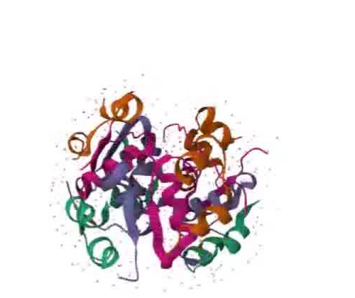
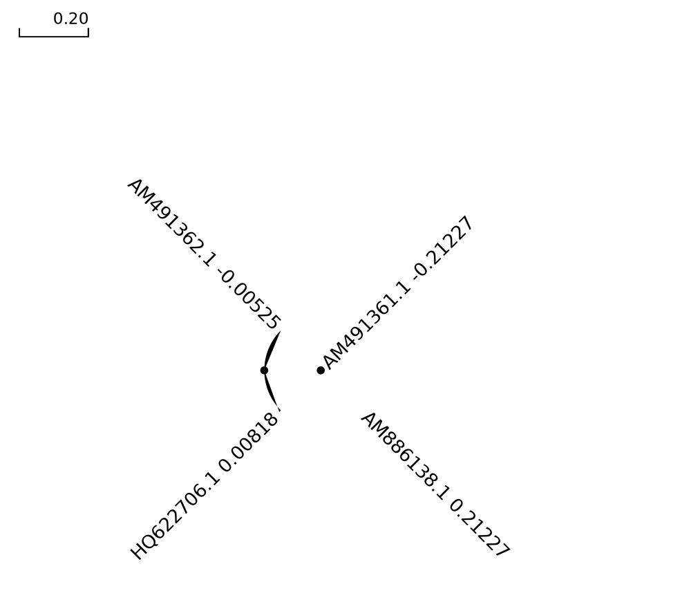

# BioComputing Portfolio: Computational Genomics & Data Pipelines

Welcome to my independent research repository. This space documents my transition from wet-lab biotechnology into **data-driven bioinformatics, structural biological simulations, and algorithmic scripting workflows**.

---

## 📄 Related Publication

**Review Article:** *AI/ML Applications in Blood Cancer (Leukemia) Diagnosis*
Published as a preprint on Zenodo — DOI: [10.5281/zenodo.22299904](https://doi.org/10.5281/zenodo.22299904)

---

## 🧬 Project 1: DNA Sequence Analyzer

A simple Python tool that analyzes a DNA sequence and reports its base composition, GC content, and validity.

**Folder:** [`dna-sequence-analyzer/`](./dna-sequence-analyzer)

- Counts each base (A, T, G, C)
- Calculates GC content (%)
- Validates that the sequence contains only valid DNA bases, flagging unexpected characters

---

## 🧪 Project 2: Physicochemical Analysis of Human Insulin

**Tool used:** ExPASy ProtParam
**Source:** NCBI Protein Database

### Key Results

| Parameter | Value |
|---|---|
| Number of amino acids | 200 |
| Molecular weight | 21,537.28 Da (~21.5 kDa) |
| Theoretical pI | 5.93 |
| Instability index | 77.16 — classified as unstable |
| GRAVY (hydropathicity) | -0.335 (hydrophilic) |

### Interpretation
Human Insulin is a medium-sized, hydrophilic protein with a slightly acidic isoelectric point, and was classified as structurally unstable under standard in vitro conditions.

### Summary Statement
*"Analyzed the physicochemical properties of Human Insulin using ExPASy ProtParam. The protein (200 aa, ~21.5 kDa) was found to be hydrophilic (GRAVY: -0.335) with an instability index of 77.16, classifying it as structurally unstable under standard conditions."*

---

## 🧫 Project 3: 3D Structure Visualization of Human Insulin

**Tool used:** RCSB PDB Mol* (WebGL) 3D Viewer | **PDB ID:** 4EYD | **Organism:** Homo sapiens

*Figure: Cartoon representation of the Human Insulin hexamer (PDB ID: 4EYD).*

### Summary Statement
*"Visualized the 3D structure of Human Insulin (PDB ID: 4EYD) using the RCSB PDB Mol* viewer, examining its hexameric assembly and chain organization."*

---

## 🩸 Project 4: Multiple Sequence Alignment & Phylogenetic Analysis of BCR-ABL1 Fusion Variants

**Tool used:** Clustal Omega (EMBL-EBI)

**Sequences analyzed (NCBI Nucleotide):** HQ622706.1 (e8a2), AM886138.1 (e13a3), AM491362.1 (e6a2), AM491361.1 (e1a3) — all *Homo sapiens* BCR-ABL1 fusion transcripts associated with leukemia

### Alignment Findings
The four BCR-ABL1 fusion variants showed substantial sequence divergence in their 5' regions, reflecting different BCR gene breakpoints (e1, e6, e8, e13). However, a conserved region was identified at the ABL1-derived 3' end of the transcripts, consistent with the shared ABL1 exon sequence retained across all fusion types and commonly targeted in BCR-ABL1 diagnostic assays.

*Figure: Phylogenetic tree of four BCR-ABL1 fusion variants, generated using Clustal Omega. AM491362.1 (e6a2) and HQ622706.1 (e8a2) cluster closely (short branch lengths), while AM886138.1 (e13a3) and AM491361.1 (e1a3) show greater divergence (longer branch lengths).*

### Interpretation
The e6a2 and e8a2 variants are more closely related to each other than to the e1a3 and e13a3 variants, suggesting greater sequence similarity between breakpoints located nearer within the BCR gene. This pattern is consistent with the known clinical association between fusion type and disease subtype in BCR-ABL1-positive leukemias.

### Summary Statement
*"Performed multiple sequence alignment and phylogenetic analysis of four BCR-ABL1 fusion transcript variants (e1a3, e6a2, e8a2, e13a3) using Clustal Omega, identifying a conserved ABL1-derived region across all variants and clustering patterns consistent with known BCR breakpoint relationships in leukemia."*

---

## 🛠 Technical Skills Demonstrated

- **Programming:** Python 3.x
- **Libraries/Tools:** Biopython, Clustal Omega, ExPASy ProtParam, RCSB PDB Mol* Viewer
- **Concepts:** Sequence analysis, GC content, physicochemical protein profiling, 3D structural visualization, multiple sequence alignment, phylogenetics

---
*Developed independently by Anam Abid — BS Biotechnology, Virtual University of Pakistan.*
